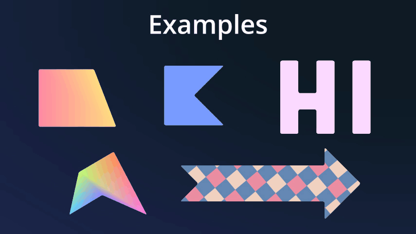

# RoundedPolygon2D

A Godot addon that extends the Polygon2D node to allow rounded corners.    

+ Corner radius
+ Corner detail
+ Uniform and non-uniform corners
+ Vertex colors
* Textures with UV mapping

## Example

